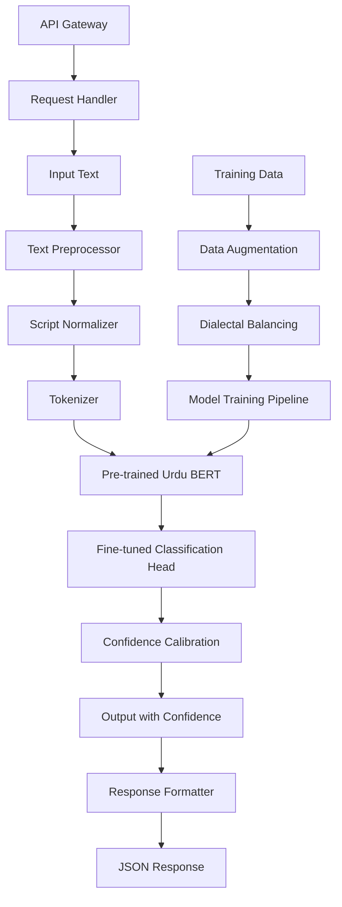

# Design Document

## Overview

The Urdu Sentiment Analysis system will be built using a transformer-based architecture leveraging pre-trained multilingual models fine-tuned specifically for Urdu sentiment classification. The system will employ a multi-stage approach: preprocessing and normalization, feature extraction using fine-tuned BERT-based models, and classification with dialectal adaptation techniques.

The architecture will support both real-time single predictions and batch processing, with a focus on handling the unique challenges of Urdu text including dialectal variations, code-mixing, and script inconsistencies.

## Architecture

### High-Level Architecture



### System Components

1. **Data Processing Pipeline**: Handles text cleaning, normalization, and augmentation
2. **Model Core**: Fine-tuned transformer model with dialectal adaptation
3. **API Service**: REST API for real-time and batch processing
4. **Evaluation Framework**: Comprehensive testing and analysis tools

## Components and Interfaces

### 1. Text Preprocessing Module

**Purpose**: Clean and normalize Urdu text for consistent model input

**Key Components**:
- `UrduTextCleaner`: Removes noise, handles URLs, mentions, and special characters
- `ScriptNormalizer`: Converts Roman Urdu to Urdu script where possible
- `DialectalNormalizer`: Standardizes common dialectal variations

**Interface**:
```python
class TextPreprocessor:
    def clean_text(self, text: str) -> str
    def normalize_script(self, text: str) -> str
    def handle_code_mixing(self, text: str) -> str
    def preprocess(self, text: str) -> str
```

### 2. Model Architecture

**Base Model**: `bert-base-multilingual-cased` or `xlm-roberta-base`
**Fine-tuning Strategy**: Task-specific fine-tuning with dialectal data augmentation

**Components**:
- `UrduBertModel`: Pre-trained transformer backbone
- `SentimentClassificationHead`: Custom classification layer
- `DialectalAdapter`: Lightweight adaptation layers for dialect handling

**Interface**:
```python
class UrduSentimentModel:
    def __init__(self, model_name: str, num_classes: int = 3)
    def forward(self, input_ids, attention_mask) -> torch.Tensor
    def predict(self, text: str) -> Dict[str, float]
    def predict_batch(self, texts: List[str]) -> List[Dict[str, float]]
```

### 3. Training Pipeline

**Components**:
- `DatasetLoader`: Handles multiple Urdu sentiment datasets
- `DataAugmenter`: Generates synthetic examples for dialectal variations
- `Trainer`: Custom training loop with evaluation metrics
- `ModelEvaluator`: Comprehensive evaluation across dialects

**Interface**:
```python
class TrainingPipeline:
    def load_datasets(self) -> Dict[str, Dataset]
    def augment_data(self, dataset: Dataset) -> Dataset
    def train_model(self, model: UrduSentimentModel) -> TrainingResults
    def evaluate_model(self, model: UrduSentimentModel) -> EvaluationResults
```

### 4. API Service

**Framework**: FastAPI for high-performance async API
**Components**:
- `SentimentAPI`: Main API endpoints
- `BatchProcessor`: Handles bulk sentiment analysis
- `ResponseFormatter`: Standardizes API responses

**Endpoints**:
- `POST /predict`: Single text sentiment analysis
- `POST /predict/batch`: Batch sentiment analysis
- `GET /health`: Service health check
- `GET /model/info`: Model metadata and performance metrics

## Data Models

### Input Models
```python
class SentimentRequest(BaseModel):
    text: str
    include_confidence: bool = True
    dialect_hint: Optional[str] = None

class BatchSentimentRequest(BaseModel):
    texts: List[str]
    include_confidence: bool = True
    dialect_hints: Optional[List[str]] = None
```

### Output Models
```python
class SentimentResponse(BaseModel):
    text: str
    sentiment: str  # "positive", "negative", "neutral"
    confidence: float
    processing_time: float
    dialect_detected: Optional[str]

class BatchSentimentResponse(BaseModel):
    results: List[SentimentResponse]
    total_processing_time: float
    batch_size: int
```

### Training Data Models
```python
class UrduSentimentSample(BaseModel):
    text: str
    label: str
    dialect: Optional[str]
    source: str
    confidence: float = 1.0
```

## Error Handling

### Error Categories
1. **Input Validation Errors**: Malformed requests, empty text, unsupported characters
2. **Model Errors**: Model loading failures, prediction errors, memory issues
3. **System Errors**: API timeouts, resource exhaustion, service unavailability

### Error Response Format
```python
class ErrorResponse(BaseModel):
    error_code: str
    message: str
    details: Optional[Dict[str, Any]]
    timestamp: datetime
```

### Error Handling Strategy
- **Graceful Degradation**: Return neutral sentiment for ambiguous cases
- **Retry Logic**: Automatic retry for transient failures
- **Fallback Models**: Simpler rule-based classifier as backup
- **Comprehensive Logging**: Detailed error tracking for debugging

## Testing Strategy

### Unit Testing
- **Component Tests**: Individual module functionality
- **Model Tests**: Prediction accuracy on known samples
- **API Tests**: Endpoint functionality and error handling

### Integration Testing
- **End-to-End Pipeline**: Full text processing workflow
- **Performance Tests**: Latency and throughput benchmarks
- **Dialectal Tests**: Performance across different Urdu dialects

### Evaluation Framework

#### Metrics
- **Standard Metrics**: Accuracy, Precision, Recall, F1-score
- **Dialectal Analysis**: Performance breakdown by dialect
- **Confidence Calibration**: Reliability of confidence scores
- **Error Analysis**: Common failure pattern identification

#### Test Datasets
- **Primary**: Manually annotated Urdu social media data
- **Dialectal**: Region-specific Urdu text samples
- **Code-mixed**: Urdu-English mixed content
- **Formal vs Informal**: News articles vs social media posts

#### Evaluation Pipeline
```python
class ModelEvaluator:
    def evaluate_overall_performance(self) -> Dict[str, float]
    def evaluate_by_dialect(self) -> Dict[str, Dict[str, float]]
    def analyze_errors(self) -> ErrorAnalysisReport
    def calibrate_confidence(self) -> CalibrationReport
```

### Performance Targets
- **Accuracy**: ≥85% on standard test set
- **Dialectal Accuracy**: ≥80% across major dialects
- **Latency**: <20ms per prediction on GPU
- **Throughput**: >100 predictions/second for batch processing

### Deployment Considerations
- **Model Serving**: TorchServe or FastAPI with GPU support
- **Scalability**: Horizontal scaling with load balancing
- **Monitoring**: Real-time performance and accuracy monitoring
- **Model Updates**: A/B testing framework for model improvements